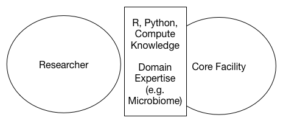

# Interaction with Cores

**Summary:** Some researchers would like more up front support from Cores in addition to back end consultation to better understand results. Faculty also understand that they have a responsibility to acquire the requisite knowledge to speak intelligently about newer data types and experiments but will need help to get up to speed. 
 
## Expectations of Cores

#### The Knowledge Gap - Communication With Cores 

Core facilities, both local and external, are challenged to produce actionable results at a reasonable cost though clients of these facilities (Microbiome and Metabolomics in particular) typically want more in terms of explanation and follow-up support as they progress towards publishable conclusions. While most of those interviewed felt comfortable with Core results being returned from Cores, some had yet to fully engage these services so could not comment on the experience. One investigator, Donghai Liang, reports satisfaction with the Metabolomics core though points out that he has worked extensively with this type of data during his Post doc experience so he has perspective that others do not. Non coincidentally, he is asked to assist with questions about metabolomics data and while he is willing to help he is increasingly engaged with his new duties.  

The Cores generally do not have the personnel or time to offer ongoing support which has produced something of a gap that is usually addressed by drafting in resources  such as post docs, Georgia Tech students, collaborators, and peers at other institutions. Addressing this gap involves a combination of activities involving the development of domain expertise by investigators (or their proxy) along with greater willingness by the Cores to treat engagements holistically as opposed to "one-and-done" transactions. This is why HERCULES should consider the formation of a data science support group to perform the necessary triage and hand offs between the group. Note that this support group isn't intended to be a "drop off" service that insulates investigators from the realities of data analysis and Core products but rather a junction point where concerns can be captured and addressed according to Center priorities and resources. 

## Understanding Results

The following figure captures the essence of the challenges when interacting with Core facilities. The best situation occurs when there is a strong intersection of knowledge between the facility and the investigator to the point wherein questions and concerns are easily addressed. Both sides have a sufficient background to ask pointed questions about software pipelines used in the process as well as some knowledge of the domain from which the data was generated (e.g. Microbiome, Metabolomics, Lipidomics). 

The second case represents the case wherein the investigator has some knowledge of at least one of the areas but needs significantly more help in other areas. This situation is more common than the first. There is light intersection of shared knowledge which subsequently provokes more questions (sometimes more advanced, sometimes basic and remedial).

## Need for More Consultation 

Additional consultation from the Cores is required given that researchers might not be well trained in a specific technique or field. This is true for both study and experimental design as well as result interpretation. Additionally, being able to point to vital working relationships to local Cores is very helpful when applying for grants. In absence of that type of relationship then external providers must be considered. One problem with core facilities is the recruitment and retention of the necessary domain expertise to complete a number of projects on time. Typically, core facilities are staffed with junior level faculty who are on their way to other career opportunities or staff who are working (many times temporarily) for less than market salaries perhaps because a partner or spouse is employed elsewhere within the institution. Lack of advancement and funding for professional development can dissuade otherwise qualified personnel from pursuing such positions. Universities such as Vanderbilt have begun to establish job descriptions and promotion and tenure policies relevant to the issue of career tracks for core directors and personnel.

## Possible Solutions 

In response to faculty input the following figure represents a type of interaction with internal cores that can help. It assumes that supplemental expertise can be assigned or mobilized in parallel (to the extent that can currently be achieved) to fully leverage results coming back from a Core. Some investigators might already have this relationship in some form (e.g. postdocs, junior faculty working on the project) but it's not a common scenario nor is it one that is realistic for junior faculty.

The following figure represents a distillation of input from faculty wherein there is ready access to a group of integrated professionals who can manage interactions (where requested) and fulfill some of the needs that is typically pushed back onto the investigator. In this scenario investigators still retain the ability to go directly to a Core or leverage the strengths of the internal Core who can manage relationships, organize training, and intelligently allocate personnel for various tasks. Obviously, this will involve recruitment and possible reorganization of existing resources (those who aren't already fully funded).

{width=450px}

