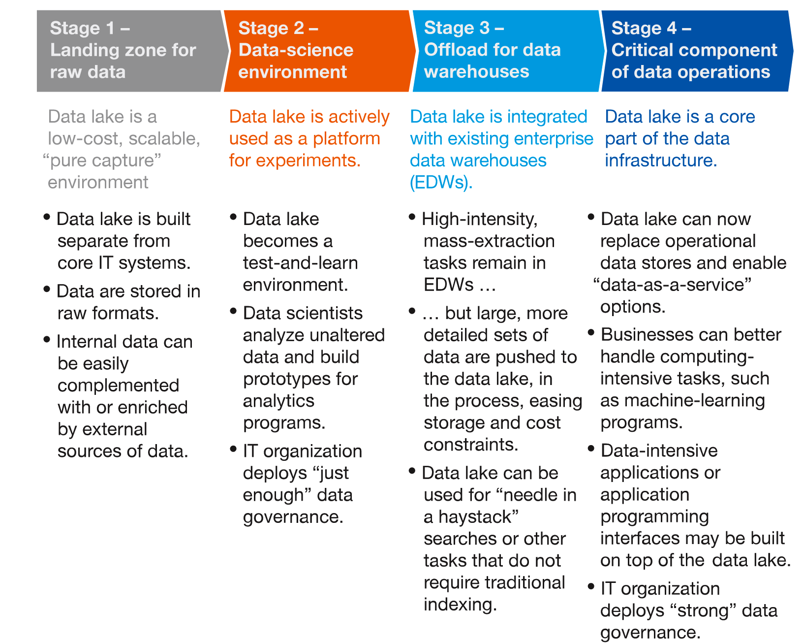

--- 
title: "Hercules Exposome Informatics Report"
author: "Steve Pittard"
date: "`r Sys.Date()`"
bibliography:
- book.bib
- packages.bib
description: This is a summary report of Hercules Exposome Interviews
documentclass: book
link-citations: yes
site: bookdown::bookdown_site
biblio-style: apalike
---

# Preface

{width=550}

## Background

The original scope of this report was focused on understanding the research being proposed and conducted by HERCULES affiliated investigators. In the course of the interview process it became apparent that there was concern about how the underlying institutional and school infrastructure has been architected (or not) to facilitate data acquisition, management, analysis, and the reproducibility of research results. Associated issues relate to interactions with Core facilities, software literacy and generally how investigators should prepare themselves and their teams to handle data emanating from collaborators and Core facilities, which increasingly requires facility with the opensource tools and computational architectures. While the promise of an institutional cloud computing environment is very appealing, most investigators have only a superficial idea about how one would fully exploit such services and how to effectively write these resources into grant proposals. From an administrative point of view the Center would like to see Pilot projects evolve into successful grant applications which would ensure ongoing support from HERCULES stakeholders.

## The Interview Process

Conducting these interviews was a smooth process as those contacted were very forthcoming with helpful responses that were consistent across the topic areas described in this report. Everyone was collegial and supplied viewpoints that will generally benefit the HERCULES Center as a whole. Everyone seems to be aware that Pilot grants should translate into successful grant applications both for the benefit of the investigator's career and in support of Center aims. The interview list included Carmen Marsit, Amber Burt, Stefanie Sarnat, Howard Chang, Dayna Johnson, Michelle Kegler, Melanie Pearson, Eberhard Voit, Eddie Morgan, Donghai Liang, and Yang Liu. 

## Summary and Recommendations:

Note that these suggestions represent starting points which could be implemented in an *a la carte* fashion although an integrated approach with other HERCULES initiatives and/or those at the institutional level should be considered - particularly in conjunction with the School of Nursing. Most of these recommendations are motivated by direct suggestions from faculty who have attempted to address problems in various ways including leveraging personal, professional, and external relationships. Note that these recommendations are not presented in a specific order or priority. Sections 2-5 provide additional perspective on the  recommendations. 

### Data Hosting and Management 

> The Center should consider using Amazon S3 as a default storage solution as well as an optional layered framework (See 1.3.3) on top of that for data and computational management. It would be ideal for the institution to provide subsidized S3 access commensurate to that which is currently provided to the Emory Box service.

Data hosting and accessibility are very important aspects of research although the current practices for supporting these activities are less than ideal. There are now three Emory storage solutions (Isilon, Box, and Amazon) and the use cases for each are not always clear to researchers. The reference data sets for many projects reside in Emory Box from which multiple copies are "fanned out" based on the number of project participants. Because of this, i results and associated code are usually not reintegrated alongside the original data which impairs reproducibility. **Unfortunately, Emory Box cannot be computed against though it is free which is why it has become the default repository for many faculty**. To reduce confusion and to provide computational "elbow room", the Center should consider using Amazon S3 as a default solution as well as an optional layered framework for data management and computation to better organize Center information. 

This could take several forms with the most basic being adoption of Amazon S3 storage as a default hosting solution for Center sponsored data. **Ideally, the institution would provide subsidized S3 access commensurate to that which is currently provided to Emory Box**. This would 1) encourage adoption of cloud computing which is a stated institutional aim and 2) increase the likelihood of cloud computing adoption since project data would be in close proximity to compute resources. Using Amazon S3 (or Google storage) is useful because it is a highly available and reliable object store that allows for intuitive partitioning according to business unit, data type, and application. Accessing this storage from other Amazon (or Google) resources is easy and well integrated with the entire suite of services on offer. 

### Using "Data Lakes"

> The Center should consider a Data Lake strategy (described in greater detail in section 2.3) in conjunction with Amazon S3. This would allow for "query-on-demand"" exploratory activity without the need to first create a highly structured data warehouse.

HERCULES projects involve a mixture of data types including PDFs, spreadsheets, SAS Data sets, CSV, accelerometer, pollution count, sequencing, and experimental data types. While this seems challenging to accommodate as a unified collection, it is better to view the catalogue as a "Data Lake" which supports the co-existence of heterogeneous data types in a way that simplifies exploration. It is useful to think of a Data Lake in terms of a "landing spot" for disparate sources of data that might be in some way related or, eventually related, depending on downstream transformations. This approach eliminates the need to impose an up front, rigid structure on the data catalogue which over time might experience the addition of new data types possibly in real time. 

The Data Lake convention enables a "query-on-demand" capability for large bodies of data - both static and dynamic. Technologies such as Apache Spark can then be employed to provided familiar structures to users, such as data frames, in a way that insulates them from the complexities of the underlying infrastructure. While there is nothing inherently "wrong" with a traditional data warehouse such as the one(s) Emory uses to host patient and health data, the "Data Lake" paradigm is the most appropriate approach for HERCULES since the data types are many and varied. Some of the projects currently being pursued do not involve particularly large data sets and can be managed using desktops or laptops in which case there is no need to move beyond that level. However, when considering the larger aims of HERCULES, the Data Lake structure has a role. The differences between a traditional Data Warehouse and a Data Lake are summarized in the following table. 

|Characteristics |Data Warehouse                                                        |Data Lake                                                                                  |
|:---------------|:---------------------------------------------------------------------|:------------------------------------------------------------------------------------------|
|Data            |Highly relational, structured and transformed                                          |Non relational and relational from IoT devices, mobile devices, instruments, 
|Schema          |Designed/created prior to the Data Warehouse implementation (schema-on-write) |Created at the time of analysis (schema-on-read)                                           |
|Performance / Price |Fast query results using higher cost storage | Fast query results using low-cost storage |
|Data Quality |Highly cleaned and curated |Any data (ie. raw data), untransformed |
|End Users |Business analysts, Physicians, Researchers |Researchers, Data scientists, Data developers, Anyone |
|Use Cases |Batch reporting, Business Intelligence and visualizations |Machine Learning, Predictive Analytics, Data Discovery |
|Security | Restricted, Strong Authentication (health data) | Open, Democratic (usually) |

The [McKinsey organization](https://www.mckinsey.com/business-functions/digital-mckinsey/our-insights/a-smarter-way-to-jump-into-data-lakes) presents a graphic which documents how spontaneous exploration and investigation can occur without a lot of "heavy lifting" by the scientist tasked with extracting meaning from an increasing data catalogue. It is helpful to think of Data Lakes as being a continuum of activities wherein one can engage the data using very basic approaches (download and analyze) or sophisticated approaches such as automated analysis processes that get triggered into action when a certain data type arrives from a real time data collection point. The benefit of the Data Lake is that explorations can be initiated by the investigator without larger IT involvement (unless desired) and human resources can be drafted in over time to develop specific applications on an as-needed basis. 

{width=650}

### Managed Data and Computation

> The Center should consider use of a tool such as DNANexus which would provide comprehensive support for managing sequencing-based projects, analytics, as well as the convenient addition of self-developed pipelines. It is layered upon Amazon compute and storage services. 

Another approach, currently under consideration by both Winship Cancer and The School of Nursing, involves the use of an integrated data management and computation tool such as [DNANexus](https://www.dnanexus.com/) which leverages Amazon computer and storage while providing an intuitive interface along with support for aggressive biomedical analytic pipelines. The product also provides extensive support for individual organizations, either separately or hierarchically, to make billing and data management transparent. This would address a number of concerns of having "everything in one place" (to the extent that it is possible) along with computational results in a format that would enable reproducibility. Additionally, a solution such as DNANexus would facilitate the integration of genomic data with clinical and other phenotypic data in a secure and compliant environment. While RedCap is useful for maintaining study information, being able to link in sequencing and sample information can be challenging. 

### HERCULES Data Science Resource

> The formation of a HERCULES Data Science support group is recommended to faciliate project completion and increase the likelihood of grant funding. At a minimum, the Center should offer an enhanced form of project management to facilitate the completion of Pilot Projects in compliance with Center aims.  

Availability of professionals who understand the analytics and informatics components of HERCULES projects is important though these resources require funding. **To this end, the formation of a HERCULES Data Science group should be considered**. (Note that "Data Science" is a general term employed here primarily to distinguish the intent of the group). It would provide up front consultation services for developing analytics, computing, and data management strategies for Pilot projects and help facilitate their success. Another role of the group would be to organize training and provide orientation for the framework mentioned in the previous section (1.3.3)  and generally help with software literacy education (1.3.5). Initial consultations would center around design and impressions about how to proceed though once the work starts, questions would naturally emerge that might require input from a number of "experts". The group would not attempt to mask problems that might currently exist at the Core level or relieve investigators of the responsibility to cultivate informatics skills within their own lab. **In fact, to be successful, this group would require the participation of a motivated representative (e.g. postdocs, data managers) from the respective labs**. 

This group would dove tail with the Environmental Health Data Sciences Core by participation in Modeling seminars that present examples of well specified research paths likely to be of interest to Center investigators. In conversation with Eberhard Voit, a co-Director of the Environmental Health Data Sciences Core, he urges early stage consultations to define a holistic trajectory for the Pilot projects that would incorporate Systems Biology expertise to anticipate downstream modeling approaches likely to support a successful grant application. A HERCULES Data Science core could then work to implement templates, where applicable, of common workflows to guide faculty and their representatives throughout the project life cycle. This would be particularly helpful when documenting required personnel, appropriate percent effort, and anticipated service core involvement when applying for Pilot grants. Whether this support group is an "official university core" or a group local to the Center is up for debate although the interviews reveal a gap between what labs can do for themselves related to informatics and comprehension of newer experimental data types. 

However, **not everyone feels that a group is necessary in that knowing how to work with data and write code is the responsibility of the investigator**. Having facility with informatics might be how an investigator would distinguish themselves and would make their funding proposals more attractive to funding agencies.  On the other hand, it is generally agreed that need for informatics support is prevalent just that some investigators feel that cultivating informatics skills within one's lab will provide independence and insulation from whatever support policies the institution at large might (or not) implement. 

### Software Literacy

> Improving general **software literacy** is essential as is being able to import/transform data, accomplish analytic tasks, create plots, query databases, and create digital assets. There is currently a gap in knowledge that should be addressed via a combination of formal courses and shorter, more focused types of education.

The paper ["Data integration in the era of omics: current and future challenges"](https://www.ncbi.nlm.nih.gov/pmc/articles/PMC4101704/) discusses the idea that 
(bio)informaticians are drawn from two distinct domains: 1) those who emerging from a computer science or mathematics background who have learned enough about biology to be helpful or 2) trained biologists who, of necessity, have acquired a knowledge of programming to approach their data. While this has been the tradition, clearly other disciplines have entered the scene to the extent that there is a ubiquitous, generic need for software and coding literacy. Both students and faculty would benefit from courses and workshops that involve prototypical informatics challenges common to omics-based research. 

The nature of these courses could be divided into two related areas: 1) Introductory material relating to the mechanics of UNIX command line, basic programming, data management, and cloud access 2) Applied courses that assume some level of software literacy. For purposes of comparison, within the School of Nursing some of the faculty have taken formal courses such as the NURS 741 "Intro to Data Science Course" which is a semester long class designed to offer a strong foundation for analytics of biomedical data. However, not all faculty are interested in this long of a commitment due to existing workload and have pursued self-education via Coursera and Edx. It remains uncertain if faculty would be interested in an actual "full-on" class unless it were shorter and less involved though this is where a local Data Science support group could help with mini-courses.

**In terms of short-term, high impact education, one excellent (and cheap) resource is to arrange for an onsite [Software Carpentry](https://software-carpentry.org/) session** which is a one to three day workshop devoted to teaching basic skills for research computing. These sessions are professionally taught and include hands on labs to learn the UNIX command line, R and Python Programming, Git, SQL and Databases. These are targeted to the novice but would also serve to reinforce skills for those with prior experience. The material is open source and maintained on GitHub so we could possibly offer the course material with local teaching resources. The following graph illustrates the motivation levels for various software and command line topics after taking a Core level Software Carpentry class. The Graduate Data Science group here at Emory has already offered one of these sessions locally and is willing to participate in more. 

{width=550}

### Student Recruitment

> Deliberate efforts should be made to recruit graduate students with ability and/or interest in data manipulation and analysis since the nature of research within the Center will require such a background. 

There is a goal of attracting software literate students who can "dive in" to projects at short notice. It is difficult to imagine a scenario wherein a postdoc or graduate student could be successful without having (or acquiring) some fluency with informatics and open source tools. Such skill can be developed over time though biomedical research assumes that students can clean, reshape, and transform data both prior to analysis and afterwards. However, they will still require guidance in the selection and execution of their work which in turn assumes the existence of a knowledgeable supportive community. This is where an association with the HERCULES Data Science support group would be beneficial. 

## Related Topics

The following subject areas require consideration although they are not uniquely related to HERCULES interests. However, because of their relevance to HERCULES researchers within the School of Public Health it is useful to consider them but not at the expense of Center aims.

### Research Desktop Support 

> HERCULES resesrchers want a higher degree of "research aware" desktop support services from Rollins IT. 

While learning more about Amazon is important, all of the faculty interviewed would like greater flexibility at the School desktop level with the ability to more easily install, update, and execute open source packages such as R, Python, Anaconda and associated opensource tools. While the Center faculty do not generally expect Rollins IT personnel to conduct research or to understand the intricacies of software workflows, there remains the feeling that IT could provide a higher base level of research exploration at the desk top level. The fact that the IT group is currently not oriented towards such activities should be not be an ongoing rationale to keep the status quo. It is agreed that the institution should apply rigorous security data policies but not in a way that impairs reasonable access to data and computation.**However, invoking the general concept of security as a means to avoid providing assistance is a concern and investigators would like to see a more nuanced approach to the application of security that recognizes their computational needs**. Obviously, securing health related data is a priority though locking down desktops at the current level is impacting personal productivity. 

### The Promise of Cloud Computing

> The School should identify paths to cloud and command-line literacy via courses and training developed internally and in conjunction with Amazon Web Services. It is important to know to what extent LITS and Rollins IT will directly be supporting AWS at a practical level. Specifically, will they be perfoming on-boarding or do they expect users to self-educate ? 

Cloud computing offers unprecedented access to scale-able, on-demand computation and storage resources in a manner that allows Emory researchers to be competitive with institutions that possess more extensive on-premise computational infrastructure. In effect, services such as Amazon and Google democratize computing by enabling access to anyone with a credit card and a willingness to learn how to leverage the environment. However, the path to productivity is not always clear and there is confusion on how to approach Amazon services even before considering how to execute at-scale bioinformatics jobs and pipelines. The language of Amazon is one of enterprise services and architecture as opposed to research computing so educational material, even at the institutional level, generally describes services conceptually when what is needed are practical workshops for teaching researchers how to apply the strengths of Amazon in a hands on way. 

The Emory LITS organization is in the process of rolling out a solution (ETA 2019) to help researchers but the larger question relates to what extent the cloud team will provide "in the trenches", hands on training and help with selecting and managing various instance types, storage resources, and databases above and beyond the architectural level. It would be useful for the LITS cloud team, Core facilities, and/or Rollins IT to offer ongoing orientation and support for adopting cloud resources. This would then simplify the layering of a more formal research oriented analytics services (e.g. HERCULES Data Science group). While we shouldn't expect IT to engage in research it is reasonable to expect them to educate users at a level that would enable them to be productive with Amazon which is a stated direction for the institution. The HERCULES Center could adopt a policy of "ground up" training that would take users from "zero to hero" relative to cloud use though that would involve more of a commitment (both human and financial) since it would be in addition to research bioinformatics interests.
Being able to make assumptions about the level of commitment offered by LITS and Rollins IT would be helpful to plan more effectively though the recommendations described in this documented could initiated independently and adjusted over time. 
