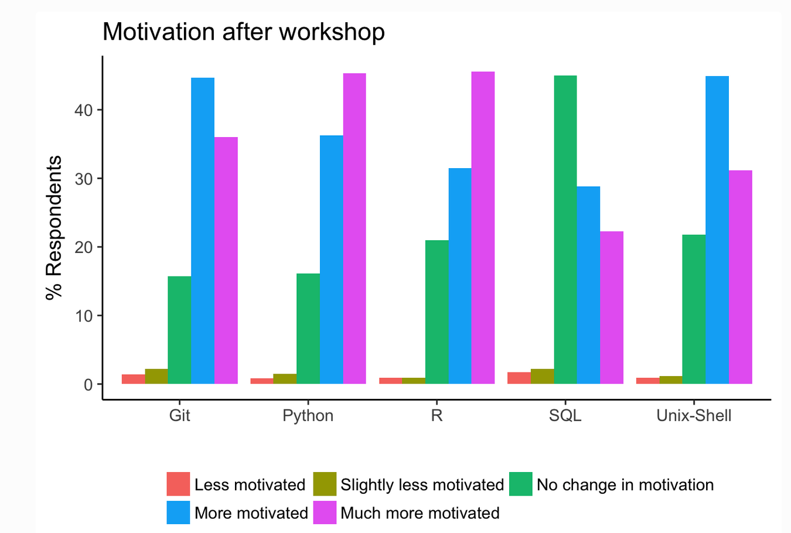

--- 
title: "Hercules Exposome Informatics Report"
author: "Steve Pittard"
date: "`r Sys.Date()`"
bibliography:
- book.bib
- packages.bib
description: This is a summary report of Hercules Exposome Interviews
documentclass: book
link-citations: yes
site: bookdown::bookdown_site
biblio-style: apalike
---

# Preface

{width=550}

## Background

The original scope of this report was focused on first understanding the research being proposed and conducted by HERCULES affiliated investigators. In the course of the interview process it became apparent that there was significant concern about how the underlying institutional and school infrastructure has been architected (or not) to facilitate data acquisition, management, analysis, and the reproducibility of research results. Associated issues relate to interactions with Core facilities, software literacy and generally how investigators should prepare themselves and their teams to better handle data as well as the results emanating from collaborators and Core facilities, which increasingly requires greater facility with the opensource tools, the "command line", and common software pipeline architectures. While the promise of an institutional cloud computing environment is very appealing, most investigators have only a superficial idea about how one would fully exploit such services and how to effectively write these resources into grant proposals. From an administrative point of view the Center would like to see Pilot projects evolve into successful grant applications which would ensure ongoing support from HERCULES stakeholders.

## The Interview Process

Conducting these interviews was a smooth process as those contacted were very forthcoming with helpful responses that were consistent across the topic areas described in this report. Everyone was collegial and supplied viewpoints that will generally benefit the HERCULES Center as a whole. Everyone seems to be aware that Pilot grants should translate into successful grant applications both for the benefit of the investigator's career and in support of Center aims. The interview list included Carmen Marsit, Amber Burt, Stefanie Sarnat, Howard Chang, Dayna Johnson, Michelle Kegler, Melanie Pearson, Eberhard Voit, Eddie Morgan, Donghai Liang, and Yang Liu. 

## Executive Summary and Initial Recommendations:

Note that these suggestions represent starting points which could selectively be implemented in an *a la carte* fashion although an integrated approach with other HERCULES initiatives and/or those at the institutional level should be considered - particularly in conjunction with the School of Nursing. Most of these recommendations are motivated by direct suggestions from faculty who have attempted to address these problems in various ways including leveraging personal, professional, and external relationships. Further discussion is warranted particularly on items relating to the formation of a Data Science support resource and the possible licensing of a data management and computation framework such as DNANexus. Sections 2-5 provide amplifications of the recommendations.

### Data Hosting and Management 

> The Center should consider using Amazon S3 as a default storage solution as well as an optional layered framework for data management and computation to better organize Center information. Ideally, the institution would provide subsidized S3 access commensurate to that which is currently provided to Emory Box. 

Data hosting and accessibility are very important aspects of research although the current practices for supporting these activities are less than ideal. There are now three Emory storage solutions (Isilon, Box, and Amazon) and the use cases for each are not always clear to researchers. The reference data copies for many projects reside in Emory Box from which multiple copies are "fanned out" based on the number of project participants. Because of this, intermediate / final results and associated code are usually not reintegrated alongside the original data which impairs reproducibility. **Unfortunately, Emory Box cannot be computed against though it is free which is why it has become the default repository for many faculty**. To reduce confusion and to provide computational "elbow room", the Center should consider using Amazon S3 as a default solution as well as an optional layered framework for data management and computation to better organize Center information. 

This could take several forms with the most basic being adoption of Amazon S3 storage as a default hosting solution for Center sponsored data. **Ideally, the institution would provide subsidized S3 access commensurate to that which is currently provided to Emory Box**. This would 1) encourage adoption of cloud computing which is a stated institutional aim and 2) increase the likelihood of adoption of cloud computing by investigators since their datq is in close proximity to compute resources. Using Amazon S3 (or Google storage) is useful because it is a highly available and reliable object store that allows for intuitive partitioning according to business unit, data type, and application. Accessing this storage from other Amazon (or Google) resources is easy and well integrated into the entire suite of services on offer. 

### Using Data Lakes

> The Center should consider a Data Lake strategy (described in greater detail in section 2.3) in conjunction with Amazon S3. This would allow for "query-on-demand"" exploratory activity without the need to first create a highly structured database that would be expensive to create. 

Given that Center projects will support a large number of data types, there is little to be gained by architecting and imposing structure on information that comes from a variety of sources, in different formats, and at different "velocities". However, simply stockpiling data in one spot, while a step in the right direction, would not immediately result in scientific insight thus some awareness of how it is organized is required to animate it. HERCULES projects involve a mixture of data types including PDFs, spreadsheets, SAS Data sets, CSV, accelermoter, pollution count, sequencing, and experimental data types. While this seems challenging to accommodate as a unified collection it is better to view this as a “Data Lake”" which supports the co-existence of heterogeneous data types in a way that enables “query on demand” for purposes of exploration. There is nothing inherently wrong with a traditional data warehouse such as the one Emory uses to host patient and health data. However, in cases where the data types are high throughput in nature and are perhaps evolving over time or accumulating at rapid speeds then the Data Lake provides the best fit. The differences between a traditional Data Warehouse and a Data Lake are summarized in the following table. 

|Characteristics |Data Warehouse                                                        |Data Lake                                                                                  |
|:---------------|:---------------------------------------------------------------------|:------------------------------------------------------------------------------------------|
|Data            |Relational, structured data                                           |Non-relational and relational from IoT devices, mobile apps, social media, and instruments |
|Schema          |Designed prior to the Data Warehouse implementation (schema-on-write) |Written at the time of analysis (schema-on-read)                                           |
|Performance / Price |Fastest query results using higher cost storage | Fast Query results using low-cost storage |
|Data Quality |Highly curated data that serves as the central version of the truth |Any data that may or may not be curated (ie. raw data) |
|Users |Business analysts, Physicians, Researchers |Researchers, Data scientists, Data developers |
|Analytics |atch reporting, Business Intelligence and visualizations |Machine Learning, Predictive analytics, data discovery and profiling |

### Managed Data and Computation

> The Center should consider use of a tool such as DNANexus which would provide comprehensive support for managing sequencing-based projects, analytics, as well as the convenient addition of self-developed pipelines. It is layered upon Amazon compute and storage services. 

Another approach, currently under consideration by both Winship Cancer and The School of Nursing, involves the use of an integrated data management and computation tool such as [DNANexus](https://www.dnanexus.com/) which leverages Amazon computer and storage while providing open support for aggressive biomedical analytic pipelines. The product also provides extensive support for individual organizations, either separately or hierarchically, to make billing and data management transparent. This would address a number of concerns of having "everything in one place" (to the extent that it is possible) along with computational results in a format that would enable reproducibility. Additionally, a solution such as DNANexus would facilitate the integration of genomic data with clinical and other phenotypic data in a secure and compliant environment. While RedCap is useful for maintaining study information, being able to link in sequencing and sample information can be challenging. 

### HERCULES Data Science Resource

> The formation of a HERCULES Data Scidence support group is recommended. Such a group would improve the working dynamic since HERCULES investigators would have advocates at the initial stage of a Pilot project and as it progresses. Note that this would not replace or diminish the relationships with existing University Cores but rather supplement them. 

Availability of professionals who understand the analytics and informatics of HERCULES sponsored projects is important though such human resources require funding. **To this end, the formation of a HERCULES Data Science group is recommended**. It would provide up front consultation services for developing analytics, computing, and data management strategies for Pilot projects and help facilite their success. Another role of the group would be to organize training and provide orientation for the framework mentioned in the previous section. Initial consultations would center around design and general impressions about how to proceed though once the work starts, questions would naturally emerge that might require input from a number of "experts". The group would not attempt to mask problems that might exist at the Core level or relieve investigators of the responsibility to cultivate informatics skills within their own lab. **In fact, to be successful, this group would require the participation of a motivated representative (e.g. postdocs, data managers) from the respective labs**. 

This group would dove tail with the Environmental Health Data Sciences Core by participation in Modeling seminars that present examples, using Center Data, of well specified research paths likely to be of interest to Center investigators. In conversation with Eberhard Voit, a co-Director of the Environmental Health Data Sciences Core, he urges additional early stage consultations to define a holistic trajectory for the Pilot projects that would incorporate his Systems Biology expertise and better anticipate the downstream, associated modeling approaches likley to support an eventual successful grant application. A HERCULES Data Science core could then work to implement schema and templates, where applicable, of common workflows to guide faculty and their representatives throughout the project life cycle. This would be particularly helpful when documenting required personnel, appropriate percent effort, and anticipated service core involvement when applying for Pilot grants. 

Whether this support group is an "official university core" or a group local to the Center is up for debate although the interviews reveal a gap between what labs can do for themselves  related to informatics and comprehension of newer experimental data types. Equally as important is the idea that such a resource could be referenced in grant applications and serve as a evidence of a formal institutional commitment to exposome-based work.

### Software Literacy

> Improving general **software literacy** is essential as is being able to import/transform data, accomplish analytic tasks, create plots, query databases, and create digital assets. There is currently a gap in knowledge that should be addressed via a combination of formal courses and shorter, more focused types of education.

The paper ["Data integration in the era of omics: current and future challenges"](https://www.ncbi.nlm.nih.gov/pmc/articles/PMC4101704/) discusses the idea that 
(bio)informaticians are drawn from two distinct domains: 1) those who emerging from a computer science or mathematics background who have learned enough about biology to be helpful or 2) trained biologists who, of necessity, have acquired a knowledge of programming to approach their data. While this is an organic pattern that will likely continue it is generally agreed that inter-disciplinary involvement is essential that will involve public health investigators and statisticians. At this point, both students and faculty would benefit from courses and workshops that involve the integration of computation, data, alongside with prototypical research challenges common to omics-based investigations. 

The nature of these courses could be divided into two related areas: 1) Introductory material relating to the mechanics of UNIX command line, basic programming, data management, and cloud access 2) Applied courses that assume some level of software literacy. For purposes of comparison, within the School of Nursing some of the faculty have taken formal courses such as the NURS 741 Intro to Data Science Course which is a semester long class designed to offer a strong foundation for Nusing-based analytics education. However, not all faculty are interested in this long of a commitment due to existing workload and have pursued self-education via Coursera and Edx. It remains uncertatin if faculty would be interested in an actual "full-on" class unless it were shorter and less involved than a for-credit course though this is where a local Data Science support group could help with mini-courses.

**In terms of short-term, high impact education, one excellent (and cheap) resource is to arrange for an onsite [Software Carpentry](https://software-carpentry.org/) session** which is a one to three day workshop devoted to teaching basic lab skills for research computing. These sessions are professionally taught and include hands on labs to learn the UNIX command line, R and Python Programming, Git, SQL and Databases. These are targeted to the novice but would also serve to reinforce skills for those with prior experience. The material is open source and maintained on GitHub so we could possibly offer the course material with local teaching resources. The following graph illustrates the motivation levels for various software and command line topics after taking a Core level Software Carpentry class. The Graduate Data Science group here at Emory has already offered one of these sessions locally and is willing to participate in more. 

{width=550}

### Student Recruitment

> Deliberate efforts should be made to recruit graduate students with ability and/or interest in data manipulation and analysis since the nature of research within the school will require such a background. 

While no one believes that using **only** student "labor" to accomplish projects is reasonable, there is a goal of attracting software literate students who can "dive in" to projects at short notice. Thus, it is difficult to imagine a scenario wherein a postdoc or graduate student could be successful without having (or acquiring) some fluency with informatics and open source tools. Such skill can be developed over time though biomedical research assumes that students can clean, reshape, and transform data both prior to analysis and afterwards. However, they will still require guidance in the selection and execution of their work which in turn assumes the existence of a knowledgeable supportive community. For better or worse, the domain of biomedical and  bioinformatics research requires a base level of quantitative skill and facility with software packages such as R, Python, and various open source tools. This is where an association with the HERCULES Data Science support group would be beneficial. 

## Related Topic Areas

The following subject areas require consideration since they transcend (but still include ) HERCULES interests. Because of their general relevance to researchers within the School of Public Health it is useful to mention these concerns as part of this report. 

### Research Desktop Support 

> HERCULES resesrchers want a higher degree of "research aware" desktop support services from Rollins IT. 

While learning more about Amazon is important, all of the faculty interviewed would like greater flexibility at the School desktop level with the ability to more easily install, update, and execute open source packages such as R, Python, Anaconda and associated opensource tools. While the Center faculty do not generally expect Rollins IT personnel to conduct research or to understand the intricacies of software workflows, there remains the feeling that IT could provide a higher base level of research exploration at the desk top level. The fact that the IT group is currently not oriented towards such activities should be not an ongoing rationale to keep the status quo. It is agreed that the institution should apply rigorous security data policies but not in a way that impairs reasonable access to data and computation.** Invoking the general concept of security as a means to avoid providing assistance is a concern and investigators would like to see a more nuanced approach to the application of security that recognizes the growing variety of open source tools**. Obviously, securing health related data is a priority though locking down desktops at the current level is impacting personal productivity. 

### The Promise of Cloud Computing

> The School should identify paths to cloud and command-line literacy via courses and training developed internally and in conjunction with Amazon Web Services. 

Cloud computing offers unprecedented access to scaleable, on-demand computation and storage resources in a manner that allows Emory researchers to be competitive with institutions that possess more extensive on-premise computational infrastructure. In effect, services such as Amazon and Google democratize computing by enabling access to anyone with a credit card and a willingness to learn how to leverage the environment. However, the path to productivity is not always clear and there is confusion on how to approach Amazon services even before considering how to execute at-scale bioinformatics jobs and pipelines. The language of Amazon is one of enterprise services and architecture as opposed to research computing so educational material, even at the institutional level, generally describes services conceptually when what is needed are practical workshops for teaching researchers how to leverage the strengths of Amazon in a hands on way. 

The Emory LITS organization is in the process of rolling out a solution (ETA 2019) to help researchers but the larger question relates to what extent the cloud team will provide "in the trenches", hands on training and help with selecting and managing various instance types, storage resources, and databases above and beyond the architectural level. It would be useful for the LITS cloud team, Core facilities, and/or Rollins IT to offer ongoing orientation and support for adopting cloud resources. If the institution is fully committed to the cloud and would provide a base level support for orienting users, this would then simplify the layering of more formal research oriented analytics services (e.g. HERCULES Data Science group). 
